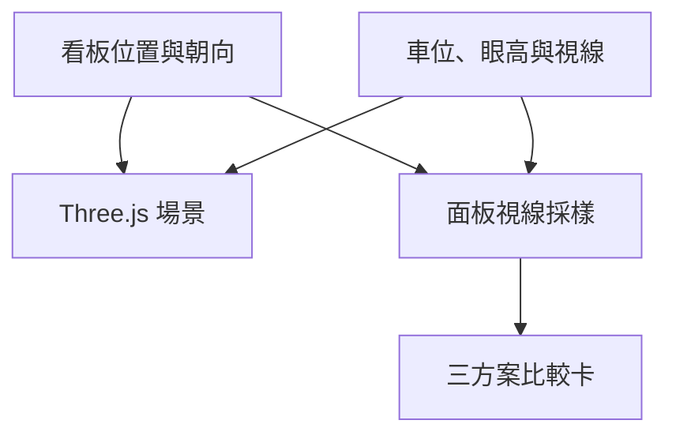

# 技術架構與修改入口

## 資料流

`app/visibility.ts` 的 `SIGN_SITES` 統一定義位置、文字與旋轉角。`scene.tsx` 用來擺放面板、支架與標示；`driver-comparison.tsx` 和 `page.tsx` 使用同一份資料呈現選單與結果。

## 座標與最後配置

Y 朝上；站在街道面向入口時，X 正向為右側，Z 正向朝街道。車道往建物內延伸為 −Z。數值是模型單位及比例假設，不是測量座標。

| key | 中心 `[x,y,z]` | yaw | 正面法向 |
|---|---|---|---|
| left | `[-3.66,1.72,-0.12]` | `Math.PI/2` | +X，朝車道內側 |
| wall | `[1.8,1.72,0.45]` | `0` | +Z，朝街道 |
| tree | `[-5.2,1.72,2.9]` | `0` | +Z，朝街道 |

`wall` 為歷史命名，現代表②右排風口。旋轉角改變面板平面與支架朝向；`signBasis()` 由 yaw 推導法向與水平切向，讓畫面與計算一致。

## 可見性

`driverPose()` 依進度建立沿街、轉入、入口前三段路徑；`measurePanel()` 對面板顯示區作 9 × 5 採樣：

1. 判斷眼睛是否位於看板正面。
2. 將採樣點投影到駕駛相機，檢查是否在畫面及前後裁切範圍。
3. 從眼睛射向採樣點，以 Raycaster 檢查樹木、建物及排風箱等障礙。
4. 回傳可見比例、角度、距離、角寬及遮擋類別。

水平視野設定為 90°，垂直視野依畫面長寬比計算。各候選看板獨立評估，其他候選看板與支架不列入障礙。靜態障礙篩選使用高度範圍；這不是完整視覺或人因模型。

## 危害動畫

雨、晃動、跌落、煙霧、光束及行人動作是時間驅動的教學編排。簡化風力使用 `q = 0.5 × 1.225 × V²`，`F = q × 1.3 × A`。沒有計算法定設計風壓、支架內力、觸電電流或實際溫升。

## 執行與部署

- 本機以 Vinext/Vite 執行 React 應用；正式建置輸出 Cloudflare Worker。
- 沒有本案必要的資料庫、雲端狀態或 ChatGPT API 呼叫；不需 OpenAI API key 即可運行模擬。
- `app/chatgpt-auth.ts`、D1 及 examples 是原 starter 保留項目，不代表本案啟用登入或資料庫。
- `.openai/hosting.json` 的原專案 ID 在 GitHub 副本中已移除，避免誤指向既有網站。
- 技術相依保留原 lockfile；沒有為匯出而升級套件或重寫架構。

## 修改後檢核

1. 位置標籤、正面法向、Three.js 物件與說明一致。
2. 從兩側接近，檢查正面／背面、視野外與遮擋三種狀態。
3. 維持預設從右側接近，確認③未被意外移位。
4. 執行 TypeScript 檢查與建置，再按變動範圍做瀏覽器驗證。
5. GitHub 提交成功不代表正式網站已部署；部署是另一個動作。
